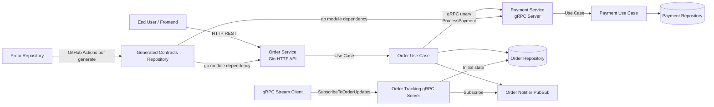

# Architecture Diagram

```mermaid
flowchart LR
    Client[End User / Frontend] -->|HTTP REST| OrderHTTP[Order Service\nGin HTTP API]
    OrderHTTP -->|Use Case| OrderUC[Order Use Case]
    OrderUC -->|gRPC unary\nProcessPayment| PaymentGRPC[Payment Service\ngRPC Server]
    PaymentGRPC -->|Use Case| PaymentUC[Payment Use Case]
    PaymentUC --> PaymentRepo[(Payment Repository)]

    OrderUC --> OrderRepo[(Order Repository)]
    OrderUC --> Notifier[Order Notifier PubSub]

    StreamClient[gRPC Stream Client] -->|SubscribeToOrderUpdates| OrderTrack[Order Tracking gRPC Server]
    OrderTrack -->|Subscribe| Notifier
    OrderTrack -->|Initial state| OrderRepo

    ProtoRepo[Proto Repository] -->|GitHub Actions buf generate| GeneratedRepo[Generated Contracts Repository]
    GeneratedRepo -->|go module dependency| OrderHTTP
    GeneratedRepo -->|go module dependency| PaymentGRPC
```
