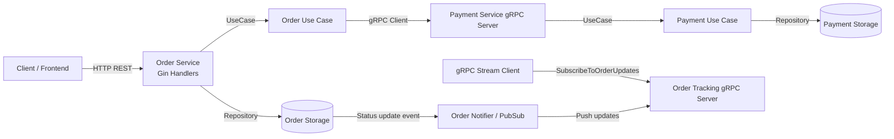

# AP2 Assignment 2: gRPC Migration & Contract-First Development

Student: Taubakabyl Nurlybek  
Course: Advanced Programming 2  
Assignment: 2 (Order & Payment)

## Repositories
- Proto Repository (Repository A): https://github.com/youruser/ap2-contracts-proto
- Generated Code Repository (Repository B): https://github.com/youruser/ap2-contracts-generated
- Services Repository (this repo): https://github.com/youruser/adp-assignment

Replace `youruser` with your actual GitHub username before submission.

## Contract-First Flow
1. Maintain only `.proto` files in `contracts-proto`.
2. GitHub Actions in proto repo runs `buf generate` on push.
3. Generated files are pushed to `ap2-contracts-generated` repo.
4. Services import generated code:
   - `github.com/youruser/ap2-contracts-generated/gen/go/payment/v1`
   - `github.com/youruser/ap2-contracts-generated/gen/go/order/v1`
5. Tag generated repo releases (`v1.0.0`, `v1.0.1`, ...), then update service dependencies.

## Project Structure
```text
contracts-proto/
  proto/order/v1/order.proto
  proto/payment/v1/payment.proto
  .github/workflows/remote-generate.yml

contracts-generated/
  gen/go/order/v1/*.pb.go
  gen/go/payment/v1/*.pb.go

payment-service/
  cmd/main.go
  internal/config
  internal/delivery/grpc
  internal/usecase
  internal/repository/memory

order-service/
  cmd/main.go
  cmd/stream-client/main.go
  internal/config
  internal/delivery/http
  internal/delivery/grpc
  internal/usecase
  internal/repository/memory
  internal/pubsub
  internal/client/payment
```

## Environment Variables
### Payment Service
Copy `payment-service/.env.example` to `.env`:
```env
PAYMENT_GRPC_PORT=50051
```

### Order Service
Copy `order-service/.env.example` to `.env`:
```env
ORDER_HTTP_PORT=8080
ORDER_GRPC_PORT=50052
PAYMENT_GRPC_ADDRESS=localhost:50051
```

## Run Instructions
1. Start Payment Service:
```bash
cd payment-service
go run ./cmd
```

2. Start Order Service:
```bash
cd order-service
go run ./cmd
```

3. Create order via REST (Order service keeps REST for external API):
```bash
curl -X POST http://localhost:8080/orders \
  -H "Content-Type: application/json" \
  -d '{"amount":100.5,"currency":"KZT"}'
```

4. Subscribe to order updates (gRPC server-side streaming):
```bash
cd order-service
go run ./cmd/stream-client -order=<ORDER_ID> -addr=localhost:50052
```

5. Trigger real status change (DB/repository write + stream push):
```bash
curl -X PUT http://localhost:8080/orders/<ORDER_ID>/status \
  -H "Content-Type: application/json" \
  -d '{"status":"SHIPPED"}'
```

You should immediately see `SHIPPED` in the streaming client output.

## gRPC APIs
### PaymentService
- `rpc ProcessPayment(PaymentRequest) returns (PaymentResponse)`

### OrderTrackingService
- `rpc SubscribeToOrderUpdates(OrderRequest) returns (stream OrderStatusUpdate)`

## Error Handling
- Payment gRPC handler uses gRPC status codes:
  - `InvalidArgument` for validation issues
  - `Internal` for unexpected server failures
- Order streaming gRPC handler uses:
  - `InvalidArgument` when order id is missing
  - `NotFound` when order does not exist
  - `Unavailable` when stream send fails

## Bonus: Interceptor
Payment Service includes a unary interceptor that logs:
- method name
- request duration

## Architecture Diagram


## Evidence Checklist (Screenshots)
- Payment service started on gRPC port.
- Order service started on HTTP and gRPC ports.
- Successful `POST /orders` response with transaction id.
- Streaming client receives initial status.
- Streaming client receives updated status right after `PUT /orders/:id/status`.
- Payment interceptor logs method and duration.

## Defense Preparation Notes
- Explain where Clean Architecture is preserved:
  - Business logic in `internal/usecase`.
  - Delivery layer in HTTP/gRPC handlers only.
- Explain how contract-first is enforced with separate proto and generated repos.
- Show commit history from Assignment 1 (REST) to Assignment 2 (gRPC migration).

## Submission
Create ZIP file named:
`AP2_Assignment2_name_surname_group.zip`

Include:
- source code
- README
- architecture diagram (included above)
- screenshot evidence
